# Backend Sequence Flow Diagram

This document provides a comprehensive overview of the backend execution flow for the Carbon Credit Marketplace API, from request initiation to final response handling.

## Table of Contents

1. [Application Startup Flow](#application-startup-flow)
2. [Request Handling Architecture](#request-handling-architecture)
3. [Authentication Flow](#authentication-flow)
4. [Calculator Agent Flow](#calculator-agent-flow)
5. [Education Agent Flow (RAG)](#education-agent-flow-rag)
6. [Matching Agent Flow](#matching-agent-flow)
7. [Marketplace Flow](#marketplace-flow)
8. [Formalities Agent Flow](#formalities-agent-flow)

---

## Application Startup Flow

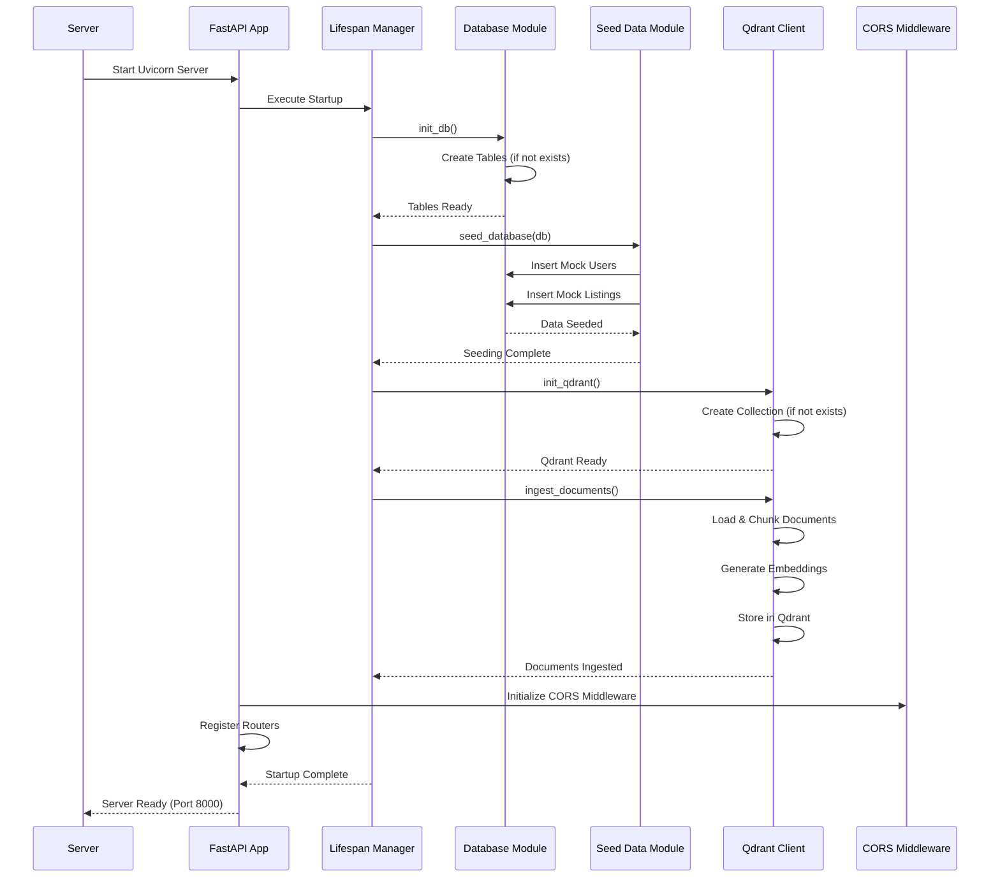

**Key Components:**
- **FastAPI App**: Main application instance
- **Lifespan Manager**: Handles startup/shutdown events
- **Database**: PostgreSQL with AsyncPG
- **Qdrant**: Vector database for RAG
- **Routers**: API endpoint handlers

---

## Request Handling Architecture

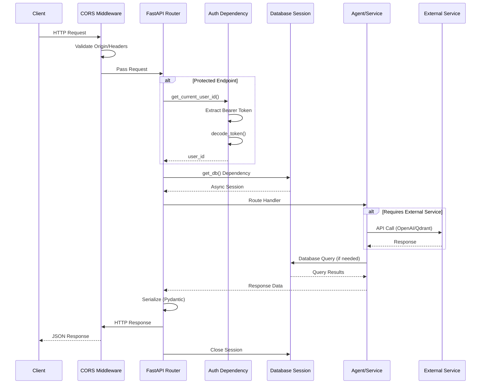

**Request Pipeline:**
1. **CORS Validation**: Checks allowed origins/headers
2. **Authentication**: JWT token validation (if protected)
3. **Database Session**: Async session dependency injection
4. **Route Handler**: Processes business logic
5. **Response Serialization**: Pydantic model validation
6. **Session Cleanup**: Automatic session closing

---

## Authentication Flow

### Registration Flow

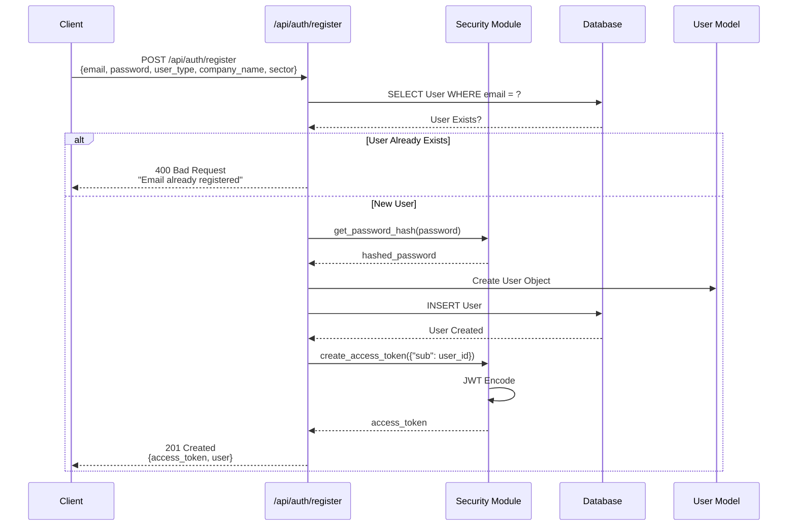

### Login Flow

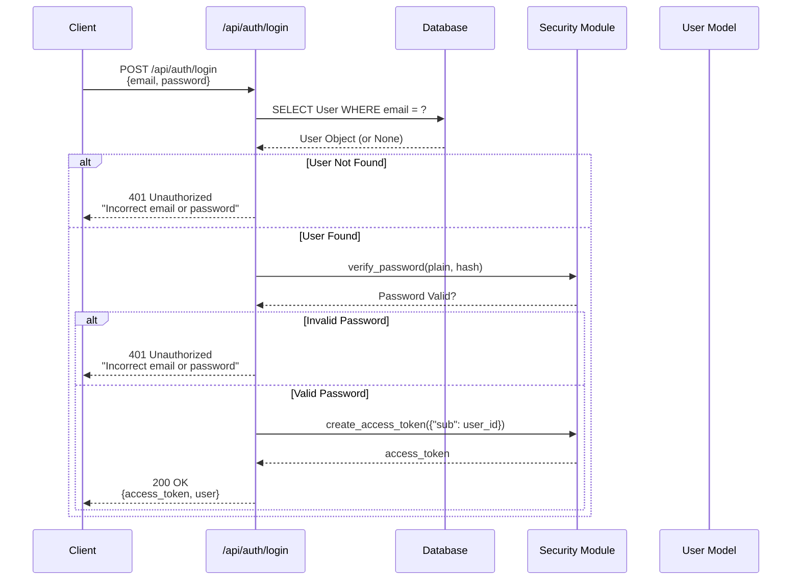

### Protected Endpoint Authentication

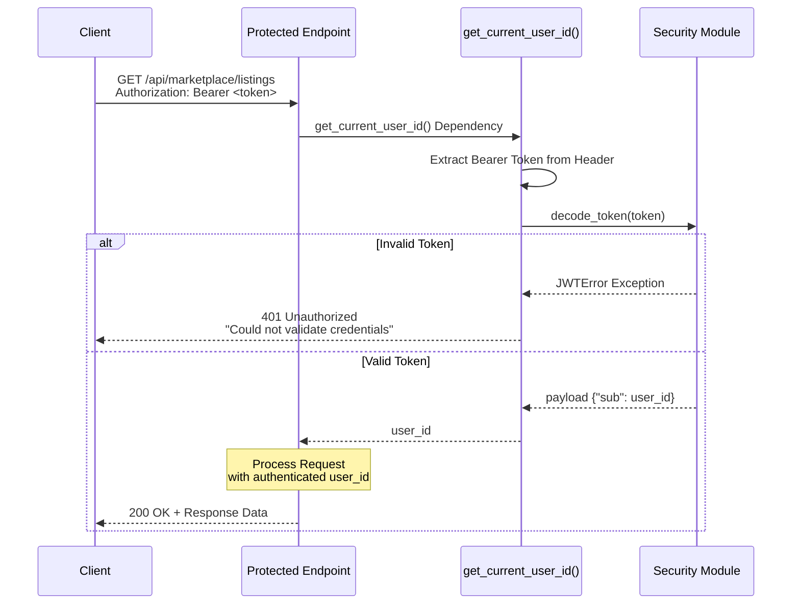

---

## Calculator Agent Flow

### Get Questions Flow

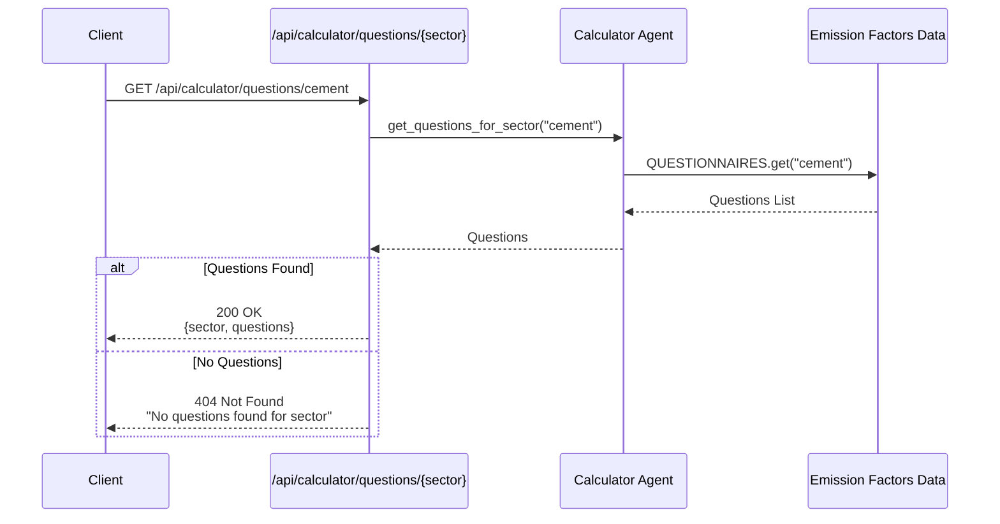

### Calculate Emissions Flow

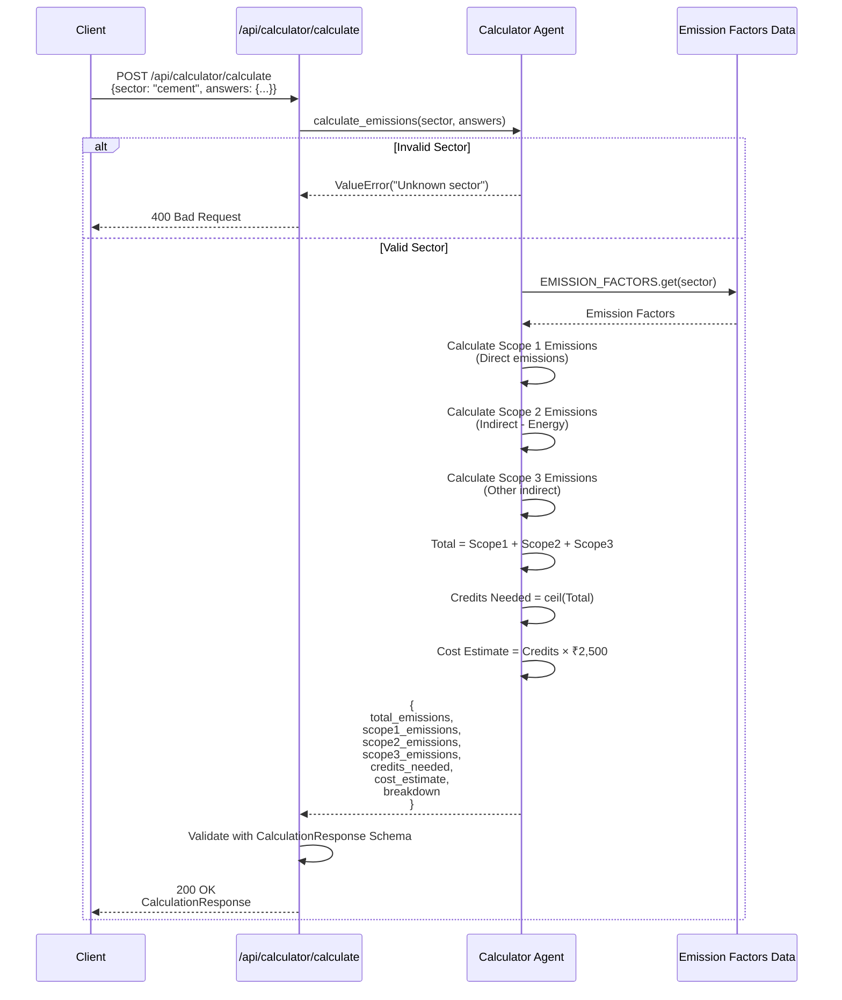

**Calculation Logic:**
- **Scope 1**: Direct emissions from owned sources
- **Scope 2**: Indirect emissions from purchased energy
- **Scope 3**: Other indirect emissions (supply chain)
- **Credits Needed**: Ceiling of total emissions
- **Cost Estimate**: Based on average credit price

---

## Education Agent Flow (RAG)

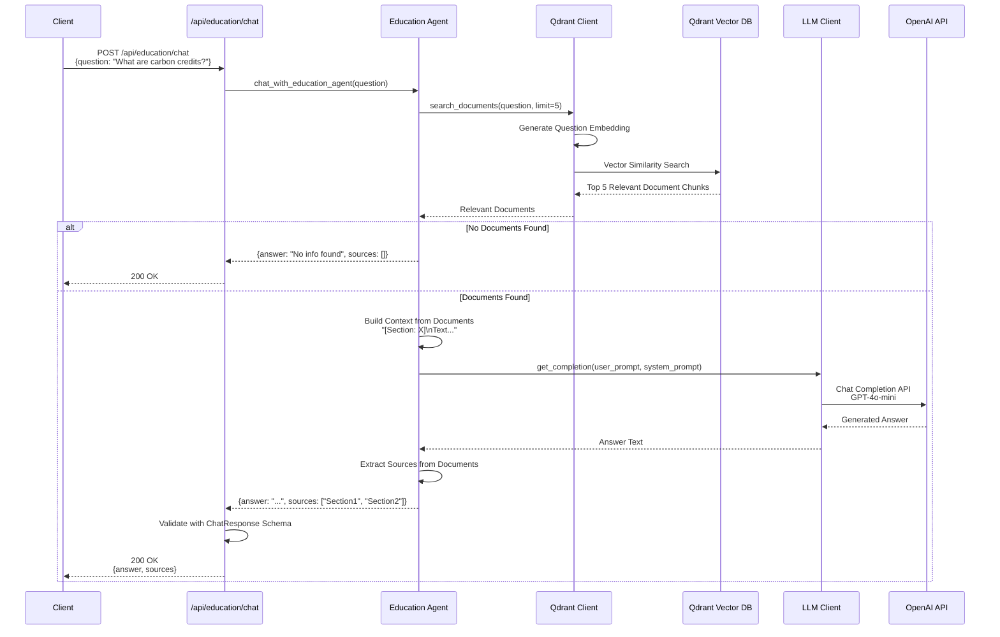

**RAG Pipeline:**
1. **Query Embedding**: Convert question to vector
2. **Vector Search**: Find similar document chunks in Qdrant
3. **Context Building**: Combine retrieved chunks
4. **LLM Generation**: Generate answer using OpenAI with context
5. **Source Extraction**: Return referenced sections

---

## Matching Agent Flow

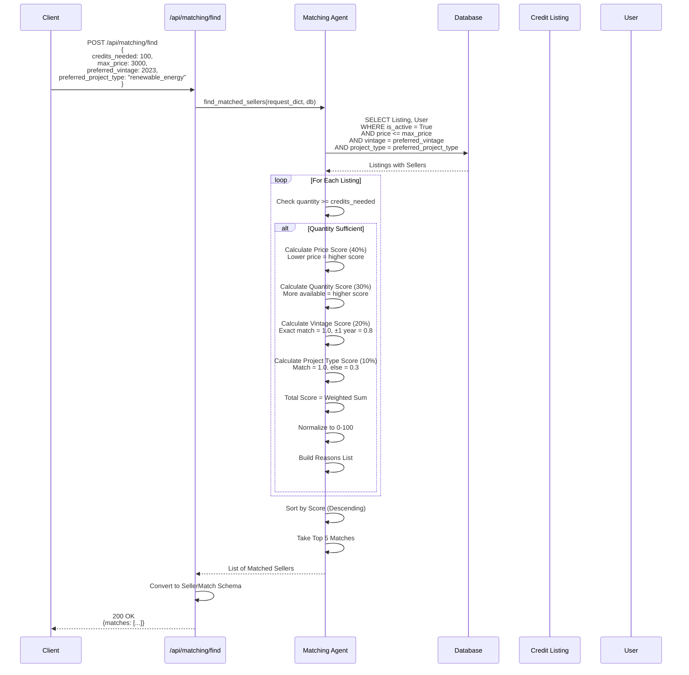

**Scoring Algorithm:**
- **Price Match (40%)**: Lower price = higher score
- **Quantity Available (30%)**: More credits = higher score
- **Vintage Match (20%)**: Exact match = 1.0, ±1 year = 0.8
- **Project Type Match (10%)**: Match = 1.0, else = 0.3

---

## Marketplace Flow

### Get Listings Flow

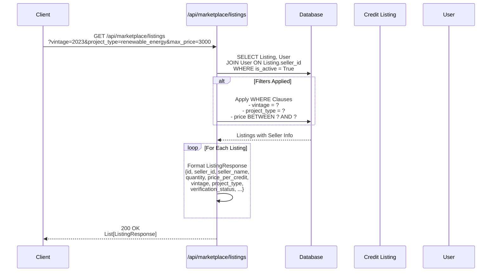

### Create Listing Flow

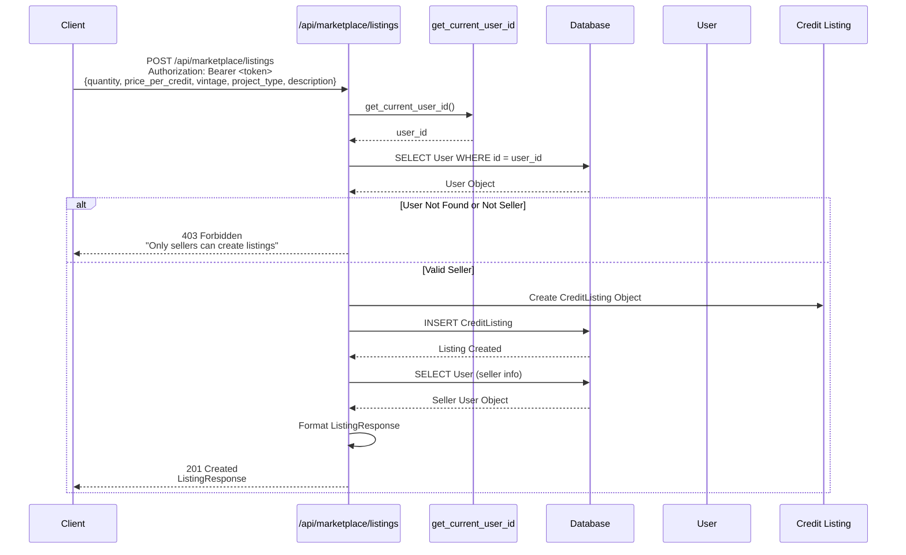

---

## Formalities Agent Flow

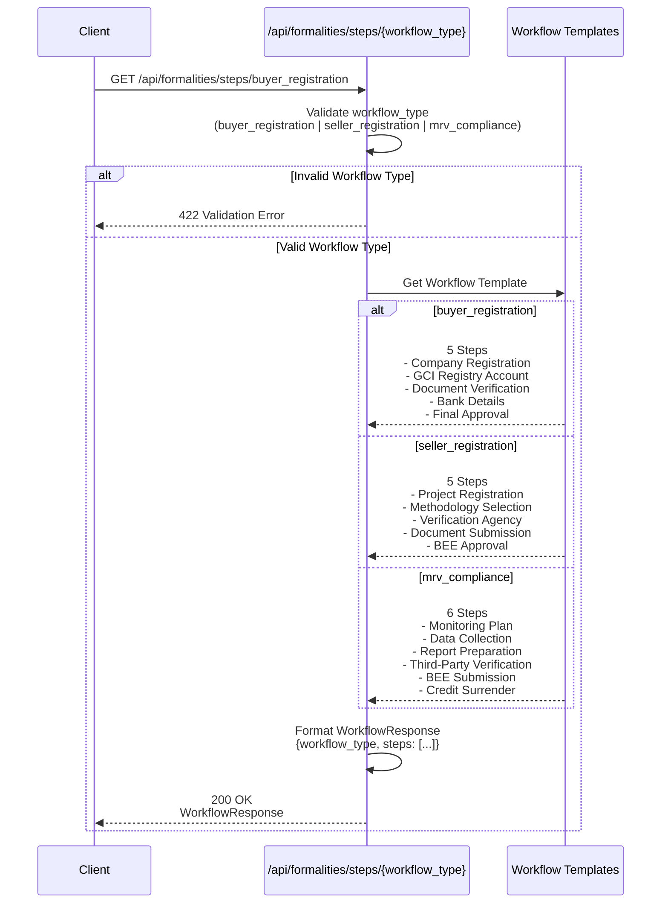

**Workflow Types:**
- **buyer_registration**: 5 steps for buyer onboarding
- **seller_registration**: 5 steps for seller/project registration
- **mrv_compliance**: 6 steps for MRV compliance workflow

---

## Error Handling Flow

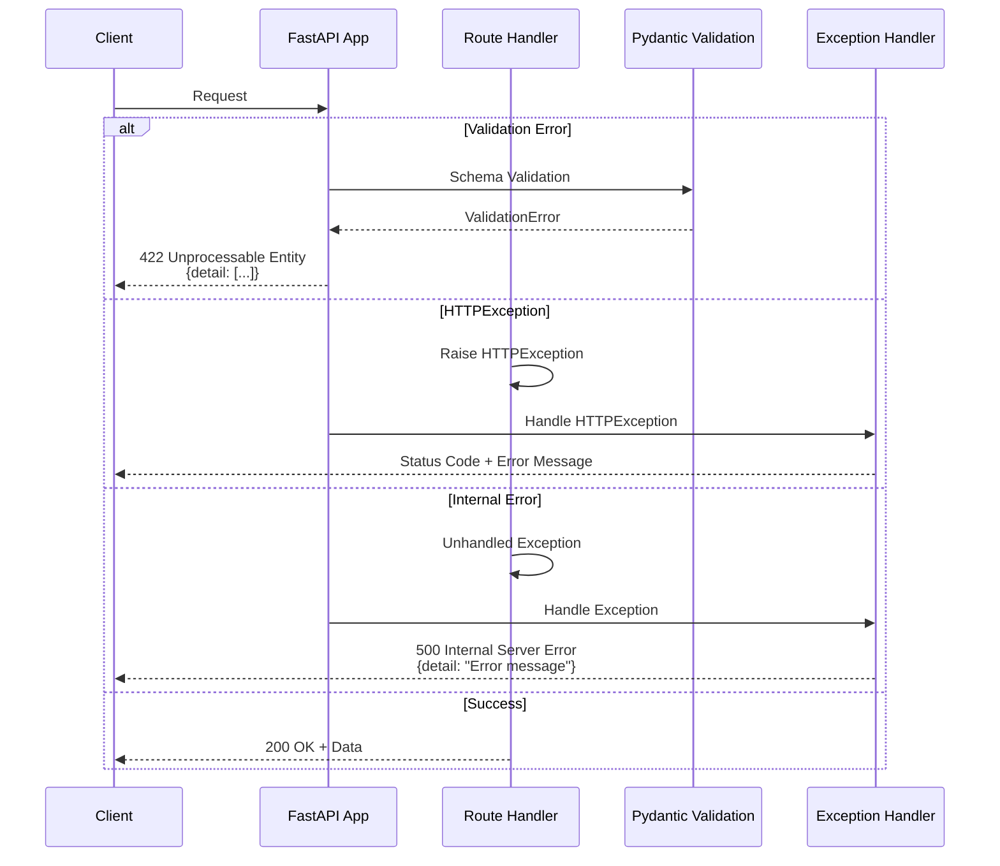

---

## Database Session Management

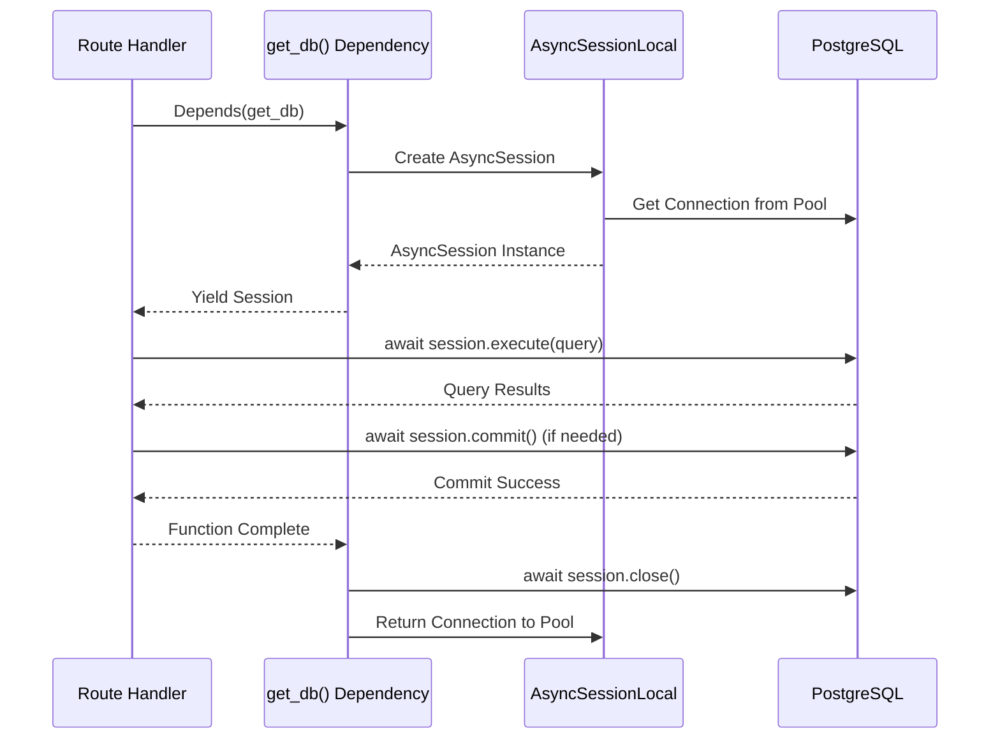

**Session Lifecycle:**
1. **Creation**: Dependency injection creates session
2. **Usage**: Query/transaction execution
3. **Commit**: Explicit or automatic on success
4. **Cleanup**: Automatic closing via dependency lifecycle

---

## Summary

The Carbon Credit Marketplace backend follows a modular, agent-based architecture:

1. **FastAPI Framework**: Async HTTP server with automatic documentation
2. **Dependency Injection**: Database sessions and authentication
3. **Agent Pattern**: Specialized agents for different functionalities
4. **RAG Integration**: Vector search + LLM for education queries
5. **Database Layer**: PostgreSQL with async SQLAlchemy
6. **Security**: JWT-based authentication with password hashing
7. **Error Handling**: Comprehensive HTTP exception handling

All flows follow the same pattern:
- **Request** → **Middleware** → **Authentication** (if protected) → **Database Session** → **Agent/Service** → **Response**

This architecture ensures scalability, maintainability, and clear separation of concerns.
